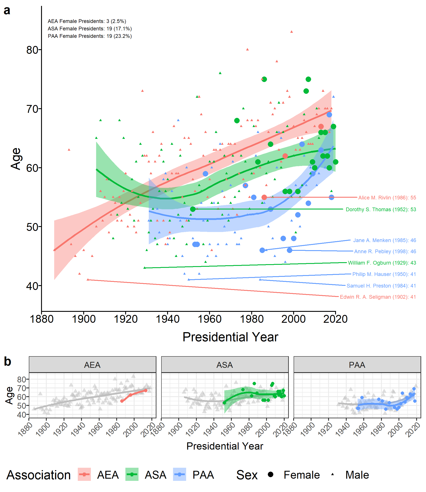

# Introduction
Here I provide the code for:  [**Sociology, Demography, and Economics Presidential Ages and Sex over time**](https://github.com/mathewhauer/presidential-ages/blob/master/manuscript.pdf)

### Citation

> Hauer, M.E. *Socius.* (DOI) (YEAR ACCESSED).

# Abstract

I provide a visualization of Presidential ages and gender over time for three academic associations: the American Sociological Association (ASA), the Population Association of America (PAA), and the American Economic Association (AEA). The figure reveals important trends in the 20th century concerning 1) the continued aging of association presidents, 2) the relatively recent increasing gender parity in association presidents of ASA and PAA but not AEA, and 3) the sharp increase in PAA presidential ages beginning near the turn of the 21st century.

# Descriptive figure

**Presidential Ages for AEA, ASA, and PAA.** This figure shows the trends in presidential ages. Points represent the age of a president at the start of their term colored by association with the shape determined by sex for both men and women (a) and isolated for just women in each association (b). The labeled names indicate the  youngest male and female presidents elected to each association along with their presidential year in parentheses and their age in that year. The trends in presidential age over time are represented with the colored lines and their associated standard error using a LOESS (span=1). The text in the top-left corner report the number and % of presidents who are female for each association. (b) also includes the trend for men for each association in gray. 

# Organization
- `SCRIPTS`  — Scripts and output for figures included in the documentation.
- `DATA`  — Initial data resources, unprocessed.
- `FIGURES` — output figures.

# Use
- Feel free to create a new branch for further incorporation and analysis . 
- More information in is located in each folder.

# Correspondence
For any issues with the functionality of these scripts please [create an issue](https://github.com/mathewhauer/presidential-ages/issues).

## License
The data collected and presented is licensed under the [Creative Commons Attribution 3.0 license](http://creativecommons.org/licenses/by/3.0/us/deed.en_US), and the underlying code used to format, analyze and display that content is licensed under the [MIT license](http://opensource.org/licenses/mit-license.php).
